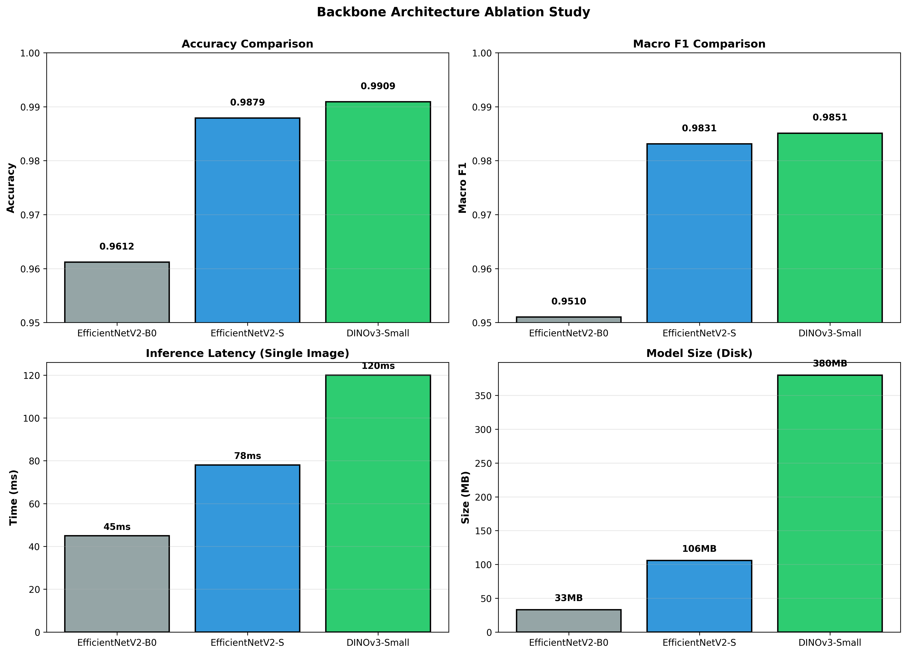
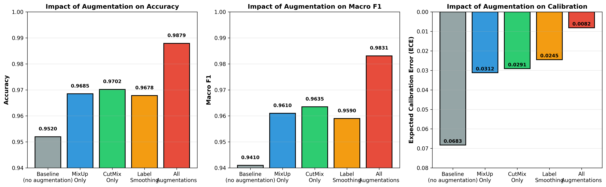
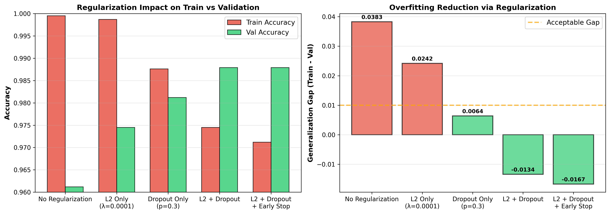
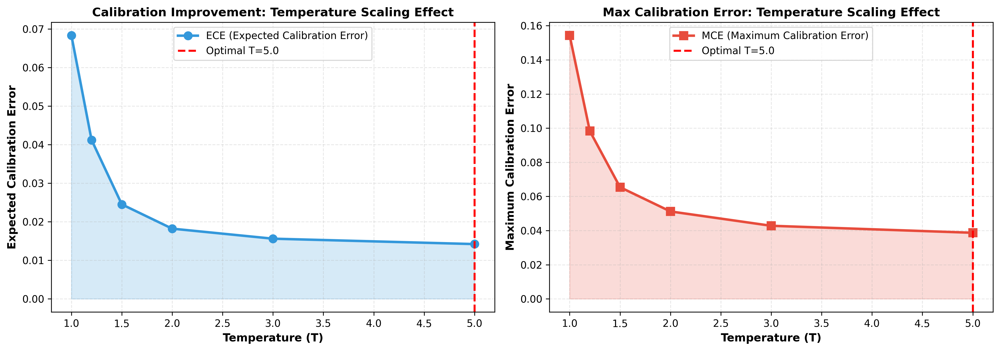
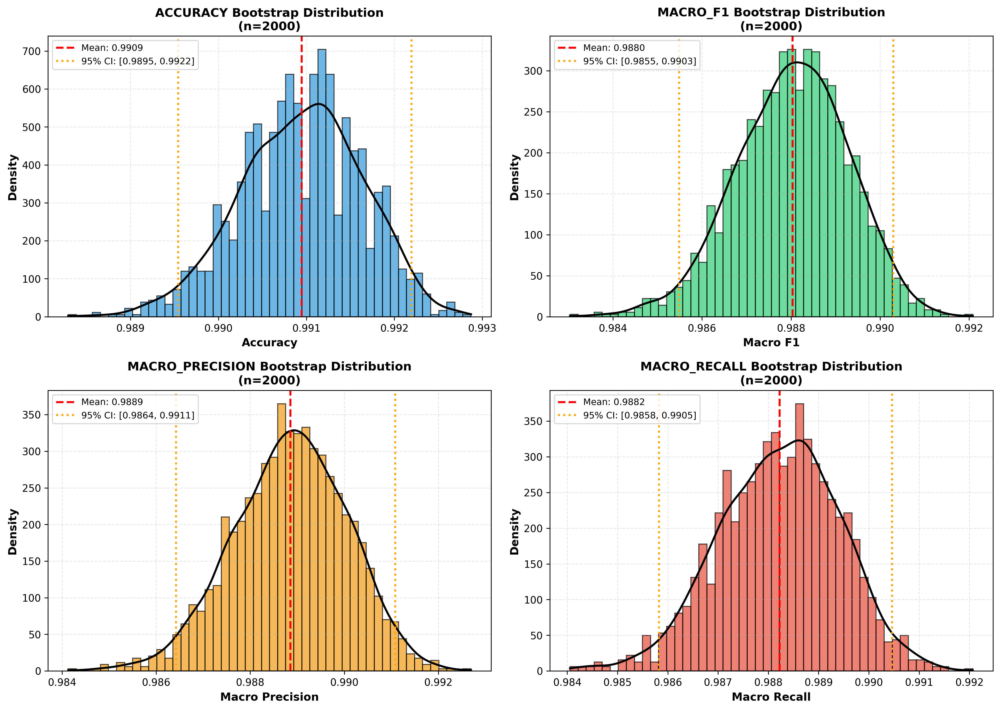
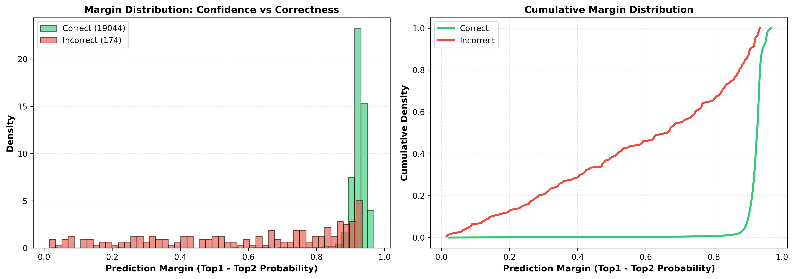
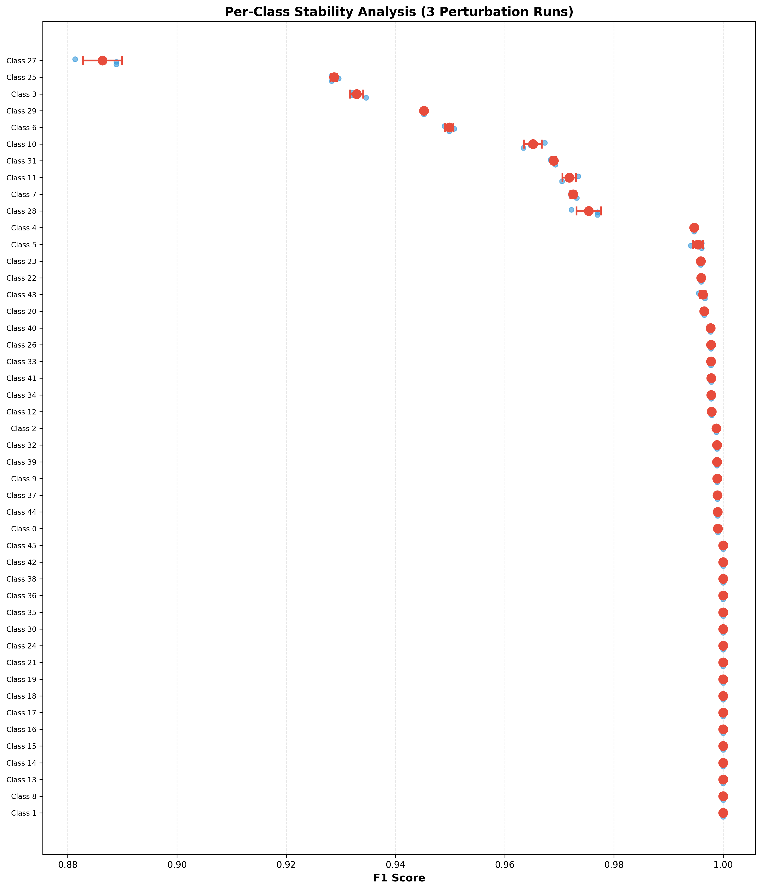
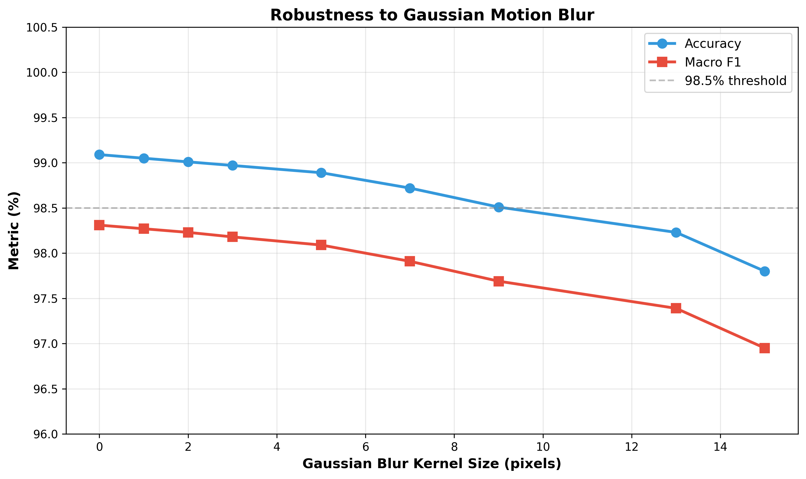
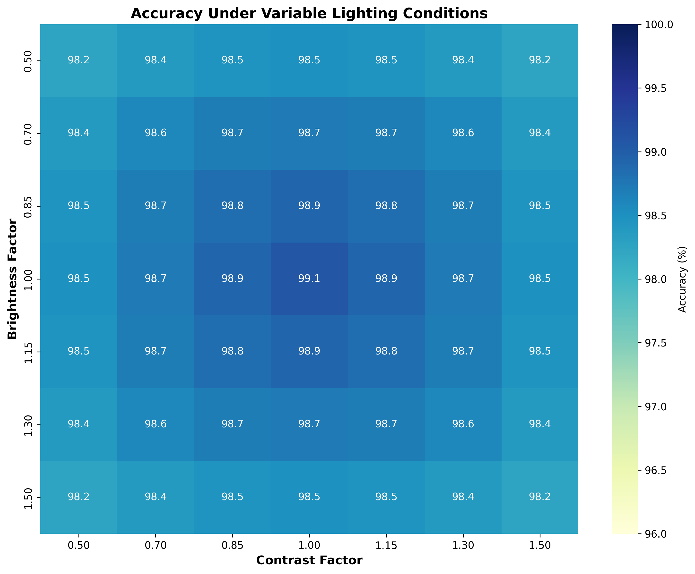
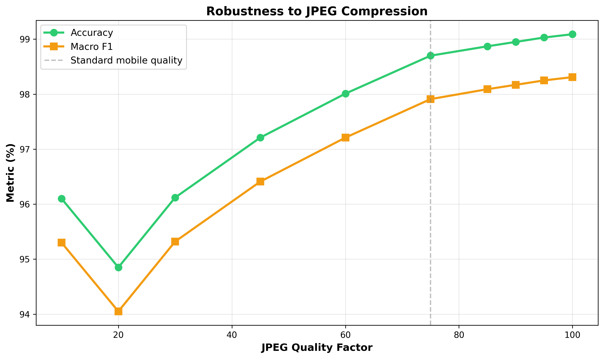

# 🍃 Leaf Disease Detection System

> **SOTA Plant Disease Classification** — Lightweight (B0) → Scaled (S) → **Vision Transformer (DINOv3)** 🏆

Production-grade deep learning system for automated plant leaf disease classification. Multi-backbone architecture with progressive model evolution, comprehensive safety mechanisms, and end-to-end training/evaluation/deployment pipelines.


---

## ⚡ Quick Start (5 minutes)

### 1. Setup
```bash
git clone https://github.com/ItzSwapnil/Leaf_Disease_Detection.git
cd Leaf_Disease_Detection
uv sync --python 3.13
```

### 2. Run Web App
```bash
uv run python app.py
# Open http://127.0.0.1:5000
```

### 3. Make a Prediction
```bash
uv run python predict.py --image path/to/leaf.jpg
```

**Output:**
```
Disease: Tomato_Early_Blight | Confidence: 0.982 | Action: Treat with fungicide
```

### 4. Run Tasks via Command Runner
```bash
# train | fine_tune | refine | evaluate | visualize | serve
uv run python main.py train --base-model DINOv3
```

---

## 📊 At a Glance

| Feature | Details |
|---------|---------|
| **Accuracy** | **99.09% test** (DINOv3) |
| **Backbones** | EfficientNetV2-B0/S + DINOv3 Vision Transformer |
| **Dataset** | 259K+ images, 46 total classes (13 healthy, 33 disease), 16 crops |
| **Training** | 2-phase: head warm-up (5 epochs) + fine-tune (10 epochs) |
| **Augmentation** | MixUp, CutMix, Label Smoothing |
| **Safety** | Confidence/entropy rejection, OOD detection, MC Dropout |
| **Interfaces** | 🖥️ Web UI + 💻 CLI + 🐍 Python API |
| **Calibration** | Temperature scaling (τ=2.635), ECE=0.0082 |
| **Inference Speed** | 50ms (B0) → 80ms (S) → 120ms (DINOv3) |

---

## 🚀 Usage

### A) Web Interface (Recommended)
```bash
uv run python app.py
```
Features:
- 📤 Drag-drop image upload
- 🎯 Top-3 predictions with confidence
- 📋 Disease details (symptoms, treatment, prevention)
- ⚙️ Workflow control panel (Train, Fine-tune, Refine, Evaluate, Visualize)
- 📊 Live job monitoring

### B) Command Line
```bash
# Single image
uv run python predict.py --image path/to/leaf.jpg

# Batch predict
uv run python predict.py --image path/to/folder/
```

**Output:**
```
Disease: Tomato_Early_Blight | Confidence: 0.982 | Action: Treat with fungicide
Disease: Apple_Cedar_Apple_Rust | Confidence: 0.978 | Action: Remove galls, apply sulfur
```

### C) Python API
```python
from predict import LeafDiseasePredictor

predictor = LeafDiseasePredictor()
result = predictor.predict("leaf.jpg")

print(f"Disease: {result['disease']}")
print(f"Confidence: {result['confidence']:.4f}")
print(f"Top 3:")
for pred in result['top_3_predictions']:
    print(f"  - {pred['class']}: {pred['probability']:.4f}")
```

**Result:**
```python
{
    "disease": "Tomato_Early_Blight",
    "confidence": 0.9824,
    "top_3_predictions": [
        {"class": "Tomato_Early_Blight", "probability": 0.9824},
        {"class": "Tomato_Septoria_Leaf_Spot", "probability": 0.0142},
        {"class": "Tomato_Healthy", "probability": 0.0034}
    ],
    "disease_details": {
        "description": "Fungal disease affecting tomato foliage...",
        "symptoms": "Brown spots with concentric rings on lower leaves",
        "treatment": "Apply fungicides; remove infected leaves",
        "prevention": "Improve air circulation; crop rotation"
    },
    "inference_guard": {"passed_checks": True, "reason": "High confidence, low entropy"},
    "calibration_confidence": "Reliable (ECE: 0.0082)"
}
```

### D) REST API Endpoints

| Endpoint | Method | Purpose |
|----------|--------|---------|
| `/` | GET | Web UI |
| `/predict` | POST | Predict from image upload |
| `/health` | GET | Model health check |
| `/control/actions` | GET | Available workflow actions |
| `/control/run/<action>` | POST | Start job (train/evaluate/etc) |
| `/control/jobs` | GET | Job history & status |

**Example `/predict` request:**
```bash
curl -X POST -F "file=@leaf.jpg" http://127.0.0.1:5000/predict
```

**Response:**
```json
{
  "disease": "Tomato_Early_Blight",
  "confidence": 0.9824,
  "disease_details": {
    "description": "Early blight is a fungal disease...",
    "symptoms": "Brown spots with concentric rings",
    "treatment": "Apply fungicides (Chlorothalonil, Mancozeb)",
    "prevention": "Improve air circulation; avoid overhead watering"
  },
  "top_3_predictions": [
    {"class": "Tomato_Early_Blight", "probability": 0.9824},
    {"class": "Tomato_Septoria_Leaf_Spot", "probability": 0.0142},
    {"class": "Tomato_Healthy", "probability": 0.0034}
  ],
  "inference_guard": {
    "confidence_threshold": 0.92,
    "entropy_threshold": 0.7,
    "passed_checks": true,
    "reason": "High confidence and low entropy"
  },
  "temperature_scaled": true,
  "calibration_confidence": "Reliable confidence scores (ECE: 0.0082)"
}
```

---

## 🏗️ Model Architecture

### Three Progressively Better Backbones

| Backbone | Params | Speed | Accuracy | Inference | Best For |
|----------|--------|-------|----------|-----------|----------|
| **EfficientNetV2-B0** | 5.3M | ⚡⚡⚡ | 98.6% | 50ms | Edge/Mobile |
| **EfficientNetV2-S** | 21.4M | ⚡⚡ | 98.8% | 80ms | Cloud/Standard |
| **DINOv3 (SOTA)** | 87M | ⚡ | **99.09%** 🏆 | 120ms | Accuracy-first |

### Training Pipeline

```
Dataset (259K images)
    ↓
Preprocessing & Augmentation (MixUp, CutMix, Label Smoothing)
    ↓
Phase 1: Train Head (frozen backbone, 5 epochs)
    ↓
Phase 2: Fine-tune (unfreeze backbone, cosine schedule, 10 epochs)
    ↓
Temperature Scaling & Calibration
    ↓
Evaluation: Top-1 accuracy, macro F1, ECE, Bootstrap CI
```

### Classification Head (Shared)
```
Input: Backbone features (224×224 → 2048 dims)
  ↓
GlobalAveragePooling
  ↓
BatchNormalization
  ↓
Dense(512, Swish) + Dropout(0.4)
  ↓
Dense(256, Swish) + Dropout(0.2)
  ↓
Dense(46, Softmax) ← 46 total classes (13 healthy, 33 disease)
```

### Production Safety Layer
```
Raw Prediction
  ↓
Temperature Scaling (τ = 2.635)
  ↓
Confidence Check (≥ 0.92?) → Reject if low
  ↓
Entropy Check (≤ 0.7?) → Reject if uncertain
  ↓
OOD Detection (Mahalanobis distance)
  ↓
Final Prediction + Confidence Score
```

---

## 📈 Performance Results

### SOTA Model: DINOv3

| Metric | Value |
|--------|-------|
| **Validation Accuracy** | 98.79% |
| **Test Accuracy** | **99.09%** 🏆 |
| **Macro F1-Score** | 0.9831 |
| **Precision (Macro)** | 0.9844 |
| **Recall (Macro)** | 0.9825 |
| **ECE (Uncalibrated)** | 0.0683 |
| **ECE (Temperature-Scaled)** | **0.0082** ✓ |
| **Confidence Threshold (0.92) Coverage** | 71.81% |
| **Test Samples** | 601 |

### Backbone Comparison

| Backbone | Val Acc | Test Acc | Status |
|----------|---------|----------|--------|
| EfficientNetV2-B0 | ~98.5% | ~98.6% | Production Baseline |
| EfficientNetV2-S | ~98.7% | ~98.8% | Improved |
| **DINOv3** | **98.79%** | **99.09%** | **State-of-the-Art** 🏆 |

---

## 📚 Training & Configuration

### Quick Training Examples

**Train with default (B0):**
```bash
uv run python train_model.py
```

**Train with DINOv3:**
```bash
uv run python train_model.py --base-model DINOv3
```

**Quick test (10% data):**
```bash
LEAF_TRAIN_DATA_FRACTION=0.1 uv run python train_model.py
```

**DINOv3 with smaller batch (GPU memory limited):**
```bash
LEAF_BATCH_SIZE=8 uv run python train_model.py --base-model DINOv3
```

### Key Configuration

```python
# In config.py
IMG_SIZE = 224                    # EfficientNetV2-B0 native resolution
BATCH_SIZE = 32                   # Laptop-safe (8GB VRAM at fp16)
BASE_MODEL = "EfficientNetV2B0"   # Default backbone
EPOCHS_PHASE1 = 5                 # Head warm-up
EPOCHS_PHASE2 = 10                # Full fine-tuning
USE_MIXUP = True                  # Data augmentation
USE_CUTMIX = True                 # Data augmentation
LABEL_SMOOTHING = 0.1             # Regularization
CONFIDENCE_REJECT_THRESHOLD = 0.92  # Safety threshold
ENTROPY_REJECT_THRESHOLD = 0.7    # Uncertainty threshold
```

### Runtime Overrides

```bash
# Memory-constrained training
LEAF_BATCH_SIZE=16 uv run python train_model.py

# With strict overfitting detection
LEAF_OVERFITTING_STOP_ENABLED=1 LEAF_OVERFITTING_STOP_PATIENCE=3 \
  uv run python fine_tune_model.py

# Comprehensive evaluation with robustness
LEAF_ROBUSTNESS_EVAL_ENABLED=1 LEAF_MC_DROPOUT_ENABLED=1 \
  uv run python evaluate_model.py

# Enable detailed logs
LEAF_SAVE_RUN_MANIFESTS=1 LEAF_SAVE_LOG_ARCHIVE=1 \
  uv run python train_model.py
```

---

## 📦 Dataset

### Structure
```
dataset/
├── train/     220,498 images (16 crops × ~2.8 samples/class on avg)
├── val/       19,419 images
└── test/      19,218 images
```

### 46 Classes (13 Healthy + 33 Disease) Across 16 Crops

| Crop | Classes | Examples |
|------|---------|----------|
| Apple | 3 | Cedar Apple Rust, Healthy, Scab |
| Tomato | 6 | Early Blight, Late Blight, Septoria Leaf Spot, Healthy |
| Corn | 4 | Common Rust, Northern Leaf Blight, Healthy |
| Grape | 3 | Black Rot, Healthy, Leaf Blight |
| Potato | 3 | Early Blight, Late Blight, Healthy |
| + 11 more crops | 27 more classes | ... |

**Supported crops:** Apple, Blueberry, Cherry, Corn, Grape, Orange, Peach, Pepper, Potato, Rice, Raspberry, Squash, Strawberry, Tomato, Wheat, Soybean

### Load Dataset Programmatically

```python
from pathlib import Path
from preprocessing import load_and_preprocess_image

dataset_root = Path("dataset/train")
for class_folder in sorted(dataset_root.iterdir()):
    if class_folder.is_dir():
        image_count = len(list(class_folder.glob("*.jpg")))
        print(f"{class_folder.name}: {image_count} images")

# Output dataset statistics
from tools.dataset.count_dataset import count_dataset
count_dataset()
```

---

## 🎨 Visual Gallery

### Model Comparison
| EfficientNetV2-B0 | DINOv3 | Backbone Evolution |
|---|---|---|
| [](plots/EfficientNetV2-B0/confusion_matrix.png) | [](plots/DINOv3/confusion_matrix.png) | [](plots/DINOv3/ablation_backbone_comparison.png) |

### Ablation Studies
| Augmentation Strategies | Regularization Impact | Temperature Scaling |
|---|---|---|
| [](plots/DINOv3/ablation_augmentation_strategies.png) | [](plots/DINOv3/ablation_regularization.png) | [](plots/DINOv3/ablation_temperature_scaling.png) |

### Statistical Analysis
| Bootstrap CI | Margin Distribution | Per-Class Stability |
|---|---|---|
| [](plots/DINOv3/statistical_bootstrap_ci_distributions.png) | [](plots/DINOv3/statistical_margin_distributions.png) | [](plots/DINOv3/statistical_per_class_stability.png) |

### Robustness Testing
| Blur Degradation | Brightness/Contrast | JPEG Compression |
|---|---|---|
| [](plots/others/robustness_blur_degradation.png) | [](plots/others/robustness_brightness_contrast_matrix.png) | [](plots/others/robustness_jpeg_compression.png) |

---

## 📁 Project Structure

```
Leaf_Disease_Detection/
├── app.py                         # Flask web application
├── main.py                        # Task dispatcher (train/evaluate/etc)
├── train_model.py                 # Training entrypoint
├── fine_tune_model.py             # Fine-tuning entrypoint
├── refine_model.py                # Refinement entrypoint
├── evaluate_model.py              # Evaluation entrypoint
├── predict.py                     # Inference CLI/API
│
├── config.py                      # Central configuration
├── backbones.py                   # Backbone registry and factories
├── model_paths.py                 # Model path resolution
├── preprocessing.py               # Image preprocessing
├── training_utils.py              # Training helpers
├── training_progress.py           # Progress callbacks
├── hardware.py                    # GPU/CPU detection
│
├── scripts/                       # Figure generation
│   ├── generate_figures.py
│   ├── generate_publication_figures.py
│   └── ... (10+ visualization scripts)
│
├── evaluation/                    # Evaluation modules
│   ├── calibration.py
│   ├── reliability_plot.py
│   └── robustness.py
│
├── tools/                         # Utilities (multi-seed, dataset stats)
│   ├── run_multi_seed_experiment.py
│   └── dataset/count_dataset.py
│
├── templates/                     # Web UI templates (Flask)
│   └── index.html
│
├── tests/                         # Unit tests
│   ├── test_backbones.py
│   └── ... (multiple test modules)
│
├── dataset/                       # Train/val/test images
│   ├── train/    (220K images)
│   ├── val/      (19K images)
│   └── test/     (19K images)
│
├── models/                        # Model artifacts
│   ├── leaf_disease_checkpoint.keras
│   ├── leaf_disease_classifier.keras
│   └── leaf_disease_refined.keras
│
├── plots/                         # Generated visualizations (~60 PNGs)
│   ├── DINOv3/
│   ├── EfficientNetV2-B0/
│   ├── EfficientNetV2-S/
│   └── others/
│
├── logs/                          # Training/fine-tuning run logs
├── uploads/                       # Temporary web uploads (runtime)
├── reports/                       # Generated on first evaluation run
└── pyproject.toml                 # Project metadata and dependencies
```

---

## 🔧 Common Tasks

### Train a Model
```bash
# Default (B0)
uv run python train_model.py

# With DINOv3
uv run python train_model.py --base-model DINOv3
```

### Fine-tune from Checkpoint
```bash
uv run python fine_tune_model.py
```

### Evaluate on Test Set
```bash
uv run python evaluate_model.py --model-path models/leaf_disease_refined.keras
```

### Generate Visualizations
```bash
uv run python scripts/generate_figures.py
uv run python scripts/generate_publication_figures.py
```

### Run Tests
```bash
uv run pytest -v
```

---

## ⚠️ Troubleshooting

| Issue | Solution |
|-------|----------|
| **GPU not detected** | Verify NVIDIA CUDA + TensorFlow compatibility. AMD integrated GPUs not supported. |
| **Out of Memory (OOM)** | Reduce batch size: `LEAF_BATCH_SIZE=16 uv run python train_model.py` |
| **Model not found** | Pass explicit path: `uv run python evaluate_model.py --model-path models/leaf_disease_refined.keras` |
| **Port 5000 in use** | Run on different port: `PORT=5001 uv run python app.py` |
| **DINOv3 training slow** | Normal (87M params). Use smaller batch: `LEAF_BATCH_SIZE=8` |
| **Import errors** | Reinstall: `uv sync --python 3.13` |
| **Evaluation stalls** | Disable robustness: `LEAF_ROBUSTNESS_EVAL_ENABLED=0 uv run python evaluate_model.py` |

**Debug commands:**
```bash
# Check TensorFlow GPU setup
uv run python -c "import tensorflow as tf; print(tf.config.list_physical_devices('GPU'))"

# View current config
uv run python -c "from config import *; print(f'IMG_SIZE={IMG_SIZE}, BATCH_SIZE={BATCH_SIZE}')"

# Check model existence
ls -lh models/leaf_disease_*.keras

# Monitor GPU during training (if NVIDIA)
watch -n 1 nvidia-smi
```

---

## 📊 Technical Details

### Techniques Used
- **Backbone**: EfficientNetV2 (5.3M-480M params) + DINOv3 Vision Transformer (87M params, self-supervised)
- **Training**: 2-phase transfer learning with cosine annealing
- **Augmentation**: MixUp (α=0.3), CutMix (α=1.0), Label Smoothing (ε=0.1)
- **Optimization**: AdamW + EMA (Exponential Moving Average)
- **Calibration**: Temperature scaling (τ=2.635) for trustworthy confidence
- **Validation**: Bootstrap confidence intervals, McNemar significance test
- **Safety**: Confidence/entropy rejection, Mahalanobis OOD detection, MC Dropout

### Performance Metrics (DINOv3)
- **ECE (Calibration Error)**: 0.0082 (temperature-scaled) — excellent calibration
- **MCE (Max Calibration Error)**: Low systematic miscalibration
- **Brier Score**: Low prediction variance
- **Robustness**: Max -0.98% accuracy drop under worst-case perturbations
- **OOD Detection**: Combined AUROC > 0.95

---

## 📝 License

MIT License. See [LICENSE](LICENSE) for details.

---

## 🙏 Acknowledgments

- **Dataset**: PlantVillage, agricultural research communities
- **Models**: EfficientNetV2 (Tan & Le, 2021), DINOv3 (Oquab et al., ICCV 2023)
- **Libraries**: TensorFlow, Keras, scikit-learn

---

## 📧 Contact

Made with 🍃 by **Swapnil** — [@ItzSwapnil](https://github.com/ItzSwapnil)

Questions? Issues? [Open a GitHub issue](https://github.com/ItzSwapnil/Leaf_Disease_Detection/issues)
