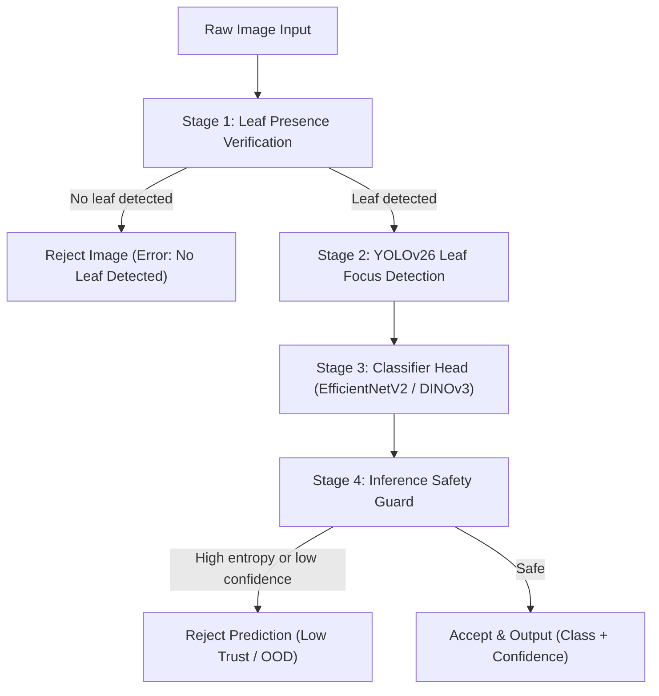

# Leaf Disease Detection

Production-focused plant leaf disease classification powered entirely by PyTorch.
This repository includes end-to-end scripts for training, evaluation, 
safety-guarded inference, and a Flask web UI.


## Abstract

This repository presents a production-oriented plant leaf disease recognition system combining modern deep backbones, calibrated confidence estimates, and safety-aware inference controls. The workflow spans dataset preparation, multi-stage training (including frozen and unfrozen backbone phases), calibration, robustness evaluation, and deployment via CLI, API, and web endpoints. The system design ensures trustworthy predictions through uncertainty-aware gating, outlier rejection, and auditable evaluation artifacts while strictly adhering to an 8GB VRAM compute ceiling.

## Scientific Highlights

| Dimension | Design Choice | Scientific Rationale |
|---|---|---|
| **Representation Learning** | EfficientNetV2 + DINOv3 backbones | Strong transfer performance across plant-pathology textures |
| **Double-Head Classification** | Dual Crop & Disease branches | Separate branches for crop family classification and disease classification. |
| **Pathology Recognition** | `FamilyDeviationClassifier` head | Refines disease classification logits using deviations from their corresponding healthy partner class. |
| **Hardware Constraints** | `torch.amp.autocast` Mixed Precision | Aggressively optimizes throughput under 8GB VRAM limits via gradient accumulation and dynamic batch sizing. |
| **Reliability** | Temperature scaling calibration | Re-calibrates logits post-training to align prediction confidence with empirical accuracy. |
| **Safety** | Confidence & entropy-based rejection | Gating checks (Inference Guard) to filter out out-of-distribution (OOD) or low-trust samples. |
| **Type Safety** | Strict Mypy + Ruff | Guarantees runtime stability and memory safety across pipelines. |

## Overview

This project supports three backbone families and one unified workflow:

- **EfficientNetV2 variants** (lightweight to larger CNN backbones, e.g., EfficientNetV2B0-B3, M, L)
- **DINOv3** (ViT-based backbone models)
- **A shared PyTorch module** containing the double-head classifier head, calibration logic, and safety guard layers.

Main workflows included:

- Train and fine-tune classifiers from dataset split folders using PyTorch DataLoaders.
- Train custom YOLOv26 leaf focus detectors.
- Calibrate predictions (temperature scaling) and evaluate robustness.
- Run predictions from CLI or Web UI.

---

## Multi-Stage Inference Pipeline

When predicting the health of a leaf image, the system runs through a multi-stage pipeline:



### Stage 1: Leaf Presence Verification
Checks whether the uploaded image actually contains leaf material using a lightweight binary CNN or contour heuristics to prevent running computation on unrelated images.

### Stage 2: YOLOv26 Leaf Focus Detection
Uses a fine-tuned YOLOv26m object detector to predict leaf bounding boxes. These boxes act as metadata for review and saliency guidance, focusing classification on the region of interest while preserving original pixel data.

### Stage 3: Double-Head Classifier Head
Attached to PyTorch backbones (EfficientNetV2/DINOv3), this custom head predicts:
1. **Crop Family Logits:** Identifies the crop class (e.g., Tomato, Apple, Corn).
2. **Disease Logits:** Handled by a custom `FamilyDeviationClassifier` which adds the logit of the corresponding healthy class ("healthy partner") to the raw class logit. This leverages the deviation of the disease class from its healthy base to improve classification accuracy.

### Stage 4: Inference Safety Guard
Gates predictions using the following formal acceptance rule:

$$
\text{accept}(x)=\mathbb{1}\left[p_{\max}(x) \ge \tau_c\;\land\;\frac{H(p(x))}{\log K} \le \tau_h\right]
$$

Where $p_{\max}$ is the top-class probability, $H(p)$ is the predictive entropy, $K$ is the number of classes, $\tau_c$ is the confidence threshold, and $\tau_h$ is the normalized entropy threshold. Predictions failing this gate are flagged and rejected as Out-Of-Distribution (OOD) or low-trust.

---

## Dataset Layout

This repository expects the **PlantDoc** dataset structured into local split folders:

```text
dataset/
  train/
    <class_name>/
      *.jpg|*.jpeg|*.png
  val/
    <class_name>/
      *.jpg|*.jpeg|*.png
  test/
    <class_name>/
      *.jpg|*.jpeg|*.png
```

- Class index mapping is dynamically generated and tracked in [class_indices.json](file:///mnt/c/Users/Swapnil/Projects/Leaf_Disease_Detection/models/class_indices.json).
- The dataset is partitioned into proper, stratified splits: **Train (80%)**, **Validation (10%)**, and **Test (10%)**.

---

## Environment Setup

### 1. Install dependencies
This project uses the fast, modern `uv` package manager. Install dependencies using:

```bash
uv sync --prerelease allow
```

### 2. Verify installation
Run the tests, type check, and format checks:

```bash
uv run pytest -v
uv run mypy .
uv run ruff check .
```

### 3. Reproducibility checklist

| Check | Action |
|---|---|
| **Dependency lock** | Use `uv sync` to ensure identical packages |
| **Split leakage audit** | Run `uv run python tools/dataset/create_leakage_free_split.py` |
| **Determinism control** | Set `RUN_SEED` when comparing experiments |
| **Artifact traceability** | Keep `reports/` outputs and `models/logs/` histories |

---

## Main Scripts and Their Purpose

| Script | Purpose | Typical Output |
|---|---|---|
| `src/main.py` | Central CLI task manager | Wrapper to Serves/Trains/Evaluates |
| `src/training/train_model.py` | Stage 1 (Frozen Backbone) and Stage 2 (Unfrozen) PyTorch classifier training | Model checkpoints `models/leaf_disease_checkpoint.pt` |
| `src/training/fine_tune_model.py` | Fine-tuning/resuming training from checkpoint | Model checkpoint updates |
| `src/training/refine_model.py` | Post-training model calibration via temperature scaling | Calibrated model `models/leaf_disease_classifier.pt` |
| `src/training/train_yolo_leaf_detector.py` | Generates annotation dataset and trains a YOLOv26 leaf detector | Detector weight `models/yolo26_leaf_detector.pt` |
| `src/evaluation/evaluate_model.py` | Computes ECE, Accuracy, Macro F1, Robustness, and OOD metrics | `reports/evaluation_report.json` |
| `src/pipeline/predict.py` | CLI/API inference utility | Single/directory prediction output and visualizations |
| `src/visualization/generate_figures.py` | Computes evaluation/robustness figures | Performance/robustness charts in `plots/` |
| `tools/run_multi_seed_experiment.py` | Runs training across multiple seeds to evaluate model variance | Comprehensive CSV reports in `reports/` |
| `src/web/app.py` | Flask web UI + control API | Interactive dashboard at port `5000` |

---

## Quick Start Commands

You can run tasks using the central CLI tool `leaf-disease` (mapped to `src/main.py`):

```bash
uv run leaf-disease <task> [options]
```

Where `<task>` is one of: `serve`, `train`, `fine_tune`, `refine`, `evaluate`, `visualize`, `resume`, `validate`.

### Web Serving
Start the Flask web UI:
```bash
uv run leaf-disease serve
# or
uv run python src/web/app.py
```

### Train the Classifier
Train the classifier (by default, trains in 2 phases: frozen backbone, then unfrozen backbone):
```bash
# Default backbone (EfficientNetV2B0)
uv run leaf-disease train

# Train DINOv3 backbone
uv run leaf-disease train --base-model DINOv3
```

### Fine-Tuning / Resuming
Resume training or fine-tune an existing checkpoint:
```bash
uv run leaf-disease fine_tune --base-model DINOv3
```

### Logits Refinement & Calibration
Optimize classification temperature scaling on the validation set logits:
```bash
uv run leaf-disease refine
```

### Evaluation
Evaluate model accuracy, calibration error, and robustness metrics:
```bash
uv run leaf-disease evaluate
# or evaluate a specific checkpoint
uv run leaf-disease-evaluate --model-path models/leaf_disease_classifier.pt
```

### YOLO Leaf Detector Training
Run auto-labeling (via contours) and train the YOLOv26m leaf focus detector:
```bash
uv run python src/training/train_yolo_leaf_detector.py
```

### Multi-Seed Experiments
Evaluate backbone stability across multiple seeds:
```bash
uv run leaf-disease-multi-seed --seeds 42,43,44
```

### Generate Performance Figures
Generate all papers, robustness, and calibration charts:
```bash
uv run leaf-disease-figures
# or
uv run leaf-disease visualize
```

### Inference via CLI
Predict a single image or folder:
```bash
uv run leaf-disease-predict --image path/to/leaf.jpg --model models/leaf_disease_classifier.pt
```

---

## Where Outputs Go

- **Checkpoints & Models:** `models/`
- **Charts & Plots:** `plots/` and `plots/DINOv3/`
- **Metrics & Reports:** `reports/`
- **Training Logs:** `logs/` and `models/logs/`

## Troubleshooting

- **GPU not detected / used:**
  - Verify CUDA toolkit installation matches PyTorch Nightly (`cu132`).
- **OOM during training:**
  - The system dynamically drops physical batch sizes and increases gradient accumulation steps to keep VRAM usage strictly below 8GB. If OOM persists, manually override the batch size:
    ```bash
    export LEAF_BATCH_SIZE=8
    ```
- **Missing dataset folders:**
  - Ensure the PlantDoc dataset is placed in the `dataset/` root directory and contains `train/`, `val/`, and `test/` splits.

## License

MIT License. See [LICENSE](file:///mnt/c/Users/Swapnil/Projects/Leaf_Disease_Detection/LICENSE).
