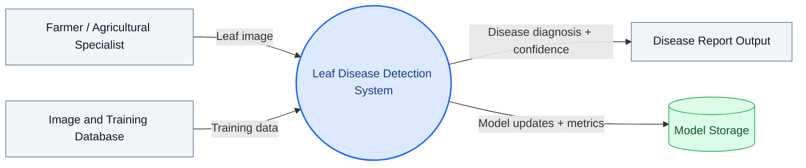

# Data Flow Diagram - Level 0 (Context Diagram)

## System Overview

Level 0 presents the complete Leaf Disease Detection System as a single process and shows how external entities interact with it.

---

## External Entities

| Entity | Description |
| ------ | ----------- |
| Farmer / Agricultural Specialist | User who submits leaf images for classification |
| Image and Training Database | Repository of labeled images used for training and validation |
| Disease Report Output | Predicted disease class and confidence result |
| Model Storage | Persisted model checkpoints and final artifacts |

## Data Flows

| Flow | From | To | Description |
| ---- | ---- | -- | ----------- |
| Leaf Image | User | System | Input image for disease analysis |
| Training Data | Database | System | Labeled samples for training and tuning |
| Disease Diagnosis | System | Report Output | Predicted class and confidence score |
| Model Updates | System | Model Storage | Checkpoints, trained weights, and metrics |

## Process Description

### Process 0: Leaf Disease Detection System

The core process:

1. Accepts user-uploaded leaf images.
2. Runs preprocessing and model inference.
3. Produces a disease class and confidence score.
4. Stores model artifacts and evaluation metrics.

---

Previous: Context level shown here.
Next: See [docs/DFD_Level1.md](docs/DFD_Level1.md) for detailed process decomposition.

Related empirical figures: [plots/class_distribution.png](../plots/class_distribution.png), [plots/learning_curves.png](../plots/learning_curves.png).
