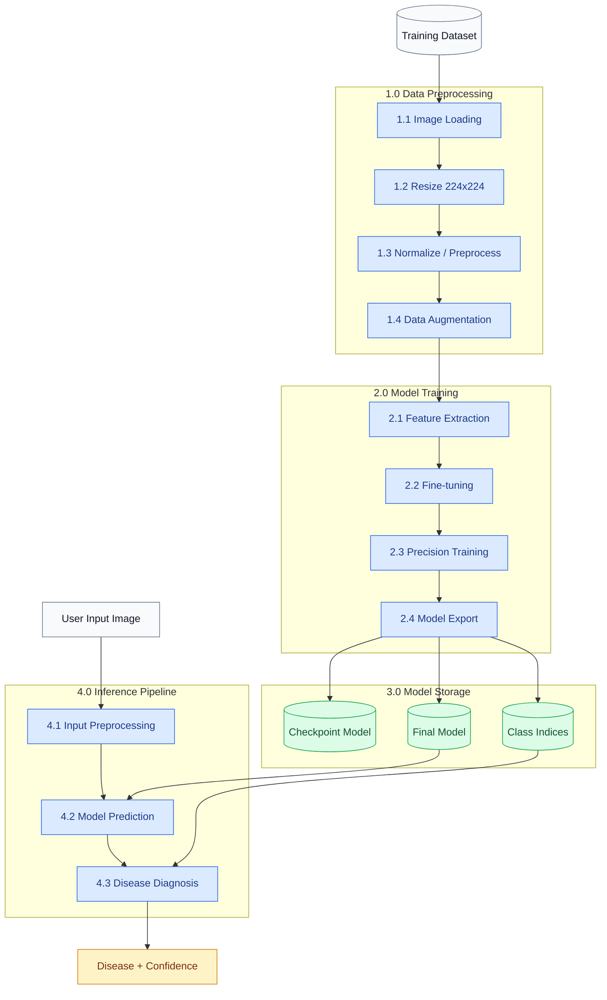

# Data Flow Diagram - Level 1 (Detailed Process View)

## Detailed System Decomposition

Level 1 expands the core system into major internal processes for data preprocessing, model training, storage, and inference.

---

## Process Descriptions

### 1.0 Data Preprocessing

| Sub-Process | Input | Output | Description |
| ----------- | ----- | ------ | ----------- |
| 1.1 Image Loading | Raw files | Image objects | Loads samples from dataset directories |
| 1.2 Resize | Variable dimensions | 224x224 tensors | Standardizes image size |
| 1.3 Normalize | Pixel values | Model-ready tensors | Applies EfficientNet preprocessing |
| 1.4 Augmentation | Training tensors | Augmented tensors | Improves generalization via transforms |

### 2.0 Model Training

| Sub-Process | Input | Output | Description |
| ----------- | ----- | ------ | ----------- |
| 2.1 Feature Extraction | Preprocessed data | Warm-up weights | Trains head with frozen base |
| 2.2 Fine-tuning | Warm-up weights | Tuned backbone | Unfreezes selected layers |
| 2.3 Precision Training | Tuned backbone | High-accuracy model | Uses low LR for final convergence |
| 2.4 Model Export | Trained weights | Model artifacts | Saves deployable files |

### 3.0 Model Storage

| Data Store | Contents | Purpose |
| ---------- | -------- | ------- |
| D1 | Checkpoint model | Best intermediate validation state |
| D2 | Final model | Production inference model |
| D3 | Class index mapping | Label id to disease name mapping |

### 4.0 Inference Pipeline

| Sub-Process | Input | Output | Description |
| ----------- | ----- | ------ | ----------- |
| 4.1 Input Preprocessing | User image | Model tensor | Aligns input format with training pipeline |
| 4.2 Model Prediction | Preprocessed tensor | Probability vector | Computes class probabilities |
| 4.3 Disease Diagnosis | Probability vector | Disease + confidence | Selects top class and confidence score |

---

## Data Dictionary

| Data Flow | Type | Format | Description |
| --------- | ---- | ------ | ----------- |
| Raw Images | Image | JPEG/PNG | Leaf image samples from users and dataset |
| Preprocessed Tensors | Tensor | (batch, 224, 224, 3) | Normalized model input batches |
| Model Artifacts | Binary | .keras | Saved model weights and topology |
| Prediction Output | Object | JSON-like | Disease name and confidence value |

---

Previous: See [docs/DFD_Level0.md](docs/DFD_Level0.md) for system context.

Related empirical figures: [plots/confusion_matrix.png](../plots/confusion_matrix.png), [plots/sample_predictions.png](../plots/sample_predictions.png).
