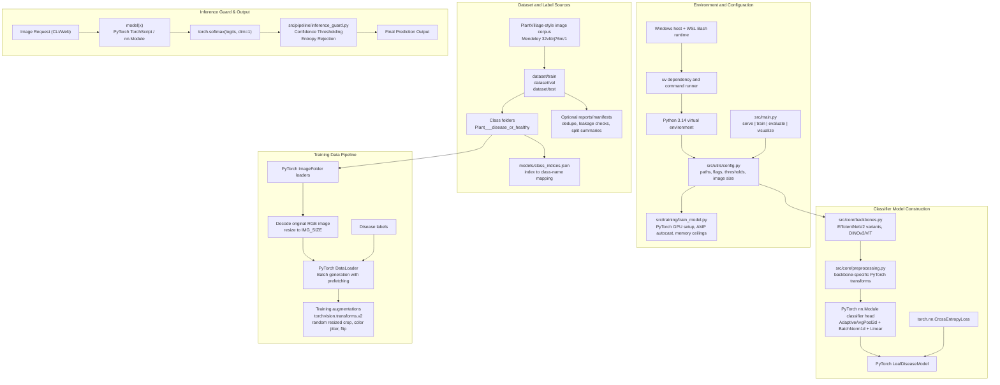

# Leaf Disease Detection Workflow

This document describes the full project workflow from local setup through
training, evaluation, inference, and web serving within the pure PyTorch
architecture ecosystem.

## End-to-End System Diagram

## Step 1: Pre-training Operations

- The user ensures the `dataset/` tree exists (train, val, test splits).
- Configuration (`src/utils/config.py`) loads environmental overrides like VRAM limits, batch sizes, and model targets.
- PyTorch DataLoaders are dynamically built to ingest, resize, and augment the `dataset/train` batches efficiently in the background using `num_workers`.

## Step 2: Training & Calibration

- Model architecture (`src/training/train_model.py`) relies exclusively on the PyTorch standard library and `torchvision`.
- Native 16-bit mixed-precision (`torch.amp.autocast(device_type="cuda")`) enforces hardware optimization and enforces 8GB VRAM budgets.
- Weights are aggressively synced to disk at epoch conclusions, alongside learning rate drops via `CosineAnnealingLR`.

## Step 3: Evaluation & Validation

- Using `uv run leaf-disease-evaluate`, the raw PyTorch model `.pt` file is passed through the evaluation pipeline.
- Validation accuracy, macro F1, and Out-Of-Distribution (OOD) tests are calculated.
- Evaluators output results to `reports/evaluation_report.json` and generate charts in `plots/`.

## Step 4: Safeguarded Inference

- Real-world predictions (via `uv run leaf-disease-predict` or the web UI) are strictly gated.
- Output logits are converted to normalized probabilities via `torch.softmax()`.
- The `inference_guard.py` script applies logical entropy gating and strict confidence thresholds. If a prediction's maximum likelihood falls below the confidence cutoff or registers with excess entropy, it is explicitly flagged and rejected.
