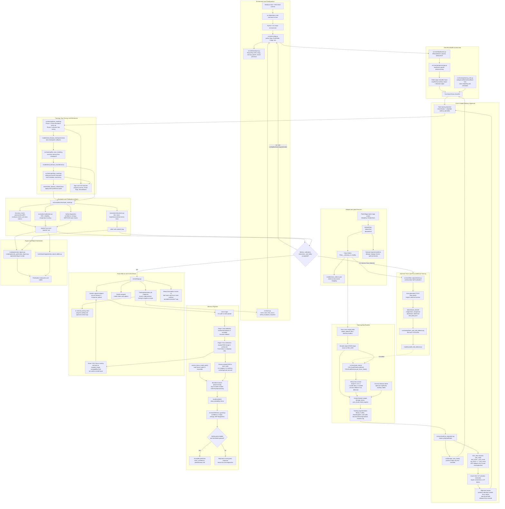
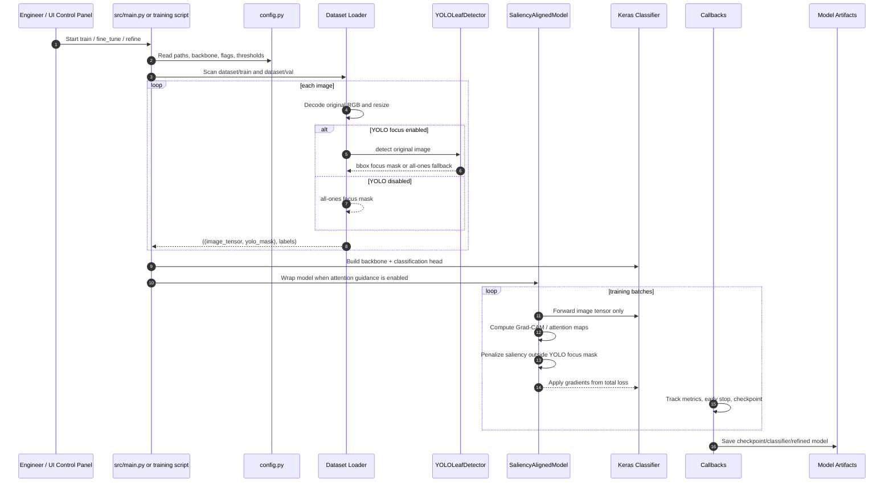
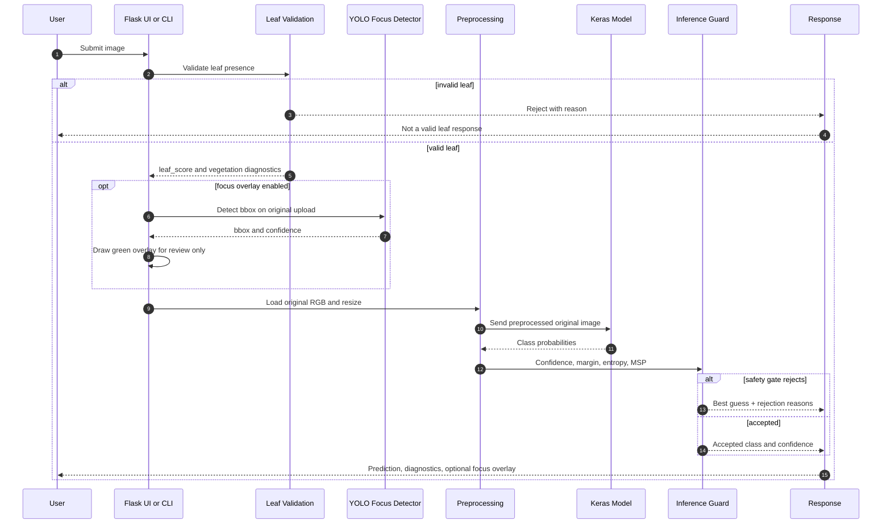

# Leaf Disease Detection Workflow

This document describes the full project workflow from local setup through
training, YOLO-guided focus alignment, evaluation, inference, and web serving.
The classifier always receives the original RGB image pixels. YOLO detections
are used only for focus masks, saliency regularization, and visual overlays.

## End-to-End System Diagram

## Training Sequence

## Inference Sequence

## Artifact Map

| Area | Main Inputs | Main Code | Outputs |
|---|---|---|---|
| Dataset | `dataset/train`, `dataset/val`, `dataset/test` | `training_utils.py`, `train_model.py` | `tf.data.Dataset` batches, class mappings |
| YOLO focus | original RGB images, optional YOLO weights | `yolo_leaf.py`, `train_yolo_leaf_detector.py` | focus masks, bbox metadata, `models/yolo26_leaf_detector.pt` |
| Training | dataset batches, config flags, backbone choice | `train_model.py`, `saliency_alignment.py`, `backbones.py` | checkpoints, classifier models, logs |
| Refinement | trained classifier/checkpoint | `fine_tune_model.py`, `refine_model.py` | deployment-ready `.keras` models |
| Evaluation | model + test split | `evaluate_model.py`, `evaluation/*.py` | reports, calibration artifacts, robustness plots |
| Inference | user image + model | `predict.py`, `disease_detection_pipeline.py`, `inference_guard.py` | prediction JSON, safety diagnostics |
| Web UI | uploads and control actions | `web/app.py`, `web/templates/index.html` | dashboard, job logs, focus overlay preview |
| Reporting | reports and metrics | `scripts/generate_*.py`, `tools/reporting/*.py` | publication figures and tables |

## Key Invariants

- Classification inputs are original resized RGB pixels.
- YOLO does not crop, mask, or remove image backgrounds for the classifier.
- YOLO focus masks are training targets for saliency alignment and review
  overlays only.
- The inference safety gate can reject low-confidence, high-entropy, or
  out-of-distribution-style predictions.
- Model preprocessing must match the loaded backbone; internal preprocessing
  blocks are detected and skipped where appropriate.
