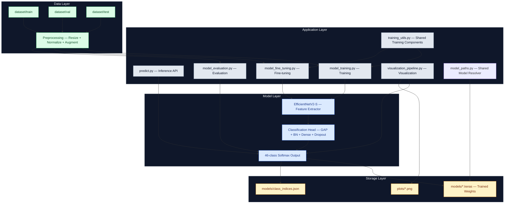
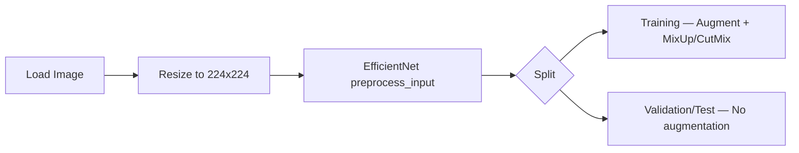
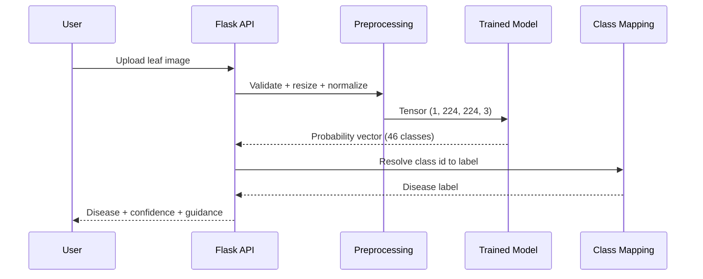

# System Architecture Documentation

## Overall Architecture

This document describes the end-to-end architecture for training, evaluating, and serving the leaf disease detection model.

---

## Neural Network Architecture

### Backbone + Classification Head

### Parameter Summary

- Base model (EfficientNetV2-S) parameters: ~20.2M
- Full model parameters: ~21.4M
- Phase 1 trainable parameters (head only): ~1.2M
- Phase 2 trainable parameters (full model): ~21.4M

---

## Training Pipeline

### Core Two-Phase Strategy

Learning rate control uses warmup + cosine annealing schedules (Loshchilov & Hutter, 2017).

### SOTA Augmentation

| Technique | Description |
| --- | --- |
| ImageDataGenerator | Rotation, flip, shift, zoom, brightness, shear |
| MixUp (Zhang et al., 2018) | Convex combination of images and labels |
| CutMix (Yun et al., 2019) | Random region cut-and-paste between images |
| Label smoothing (0.1) | Soft target regularisation |

### Data Preprocessing

---

## Inference Pipeline

---

## File Responsibilities

| Module | Purpose | Key Outputs |
| --- | --- | --- |
| `model_training.py` | Primary two-phase training workflow | Checkpoint and model artifacts |
| `model_fine_tuning.py` | Resume/precision training from checkpoint | Improved model weights |
| `model_evaluation.py` | Validation metrics and error analysis | JSON/Markdown reports |
| `predict.py` | Inference API and CLI | Disease label and confidence |
| `visualization_pipeline.py` | Standard figure generation | Confusion matrix, curves, sample predictions |
| `training_utils.py` | Shared training components (LR, loss, augmentation) | Used by all training scripts |
| `model_paths.py` | Shared model path resolution | Consistent `.keras` fallback behavior |
| `preprocessing.py` | Backbone-aware input normalisation | Used by all inference paths |
| `hardware.py` | GPU detection and distribution strategy | Used at startup by all scripts |

---

## Deployment Considerations

### Runtime and Performance

- Training: 8 GB system RAM minimum, 16 GB recommended. NVIDIA GPU with 8+ GB VRAM.
- Inference: 2 GB RAM is usually sufficient for single-image predictions.
- CPU threading can be tuned via `INTRA_OP_THREADS` / `INTER_OP_THREADS` in `config.py`.

### GPU Notes

- Only NVIDIA GPUs (CUDA) are supported by TensorFlow's GPU backend.
- AMD integrated GPUs (e.g., Radeon 860M) are not visible to TensorFlow.
- Mixed precision (`float16`) is enabled automatically when a GPU is detected.

### Scalability

- Suitable for Flask API deployment behind a reverse proxy.
- Can be containerized for cloud or edge environments.
- Model export path supports conversion workflows such as TensorFlow Lite.

---

## Empirical Visualizations

The following generated figures provide empirical support for training behavior and classification quality.

