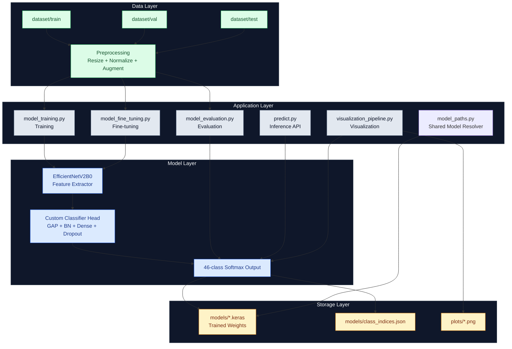
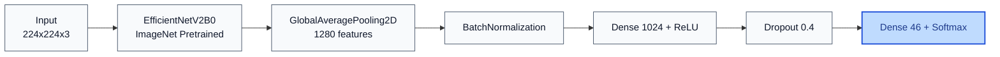
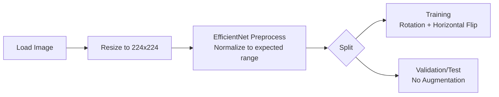
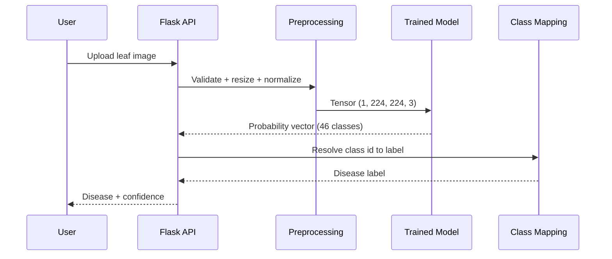

# System Architecture Documentation

## Overall Architecture

This document describes the end-to-end architecture for training, evaluating, and serving the leaf disease detection model.

---

## Neural Network Architecture

### Backbone + Classification Head

### Parameter Summary

- Base model parameters: approximately 5.9M
- Full model parameters: approximately 7.3M
- Fine-tuned trainable parameters: approximately 2.1M

---

## Training Pipeline

### Core Two-Phase Strategy

Learning-rate control uses optimizer schedules (cosine restarts). ReduceLROnPlateau is disabled to avoid conflicts with schedule-managed learning rates.

### Data Preprocessing

---

## Inference Pipeline

---

## File Responsibilities

| Module | Purpose | Key Outputs |
| ------ | ------- | ----------- |
| `model_training.py` | Primary training workflow | Checkpoint and model artifacts |
| `model_fine_tuning.py` | Resume/precision training | Improved model weights |
| `model_evaluation.py` | Validation and test metrics | Accuracy and evaluation summaries |
| `predict.py` | Inference logic | Disease label and confidence |
| `visualization_pipeline.py` | Plot generation | Confusion matrix, curves, analysis visuals |
| `model_paths.py` | Shared model path resolution | Consistent `.keras` fallback behavior |

---

## Deployment Considerations

### Runtime and Performance

- Training: 8 GB RAM minimum, 16 GB recommended.
- Inference: 2 GB RAM is usually sufficient for single-image predictions.
- CPU threading can be tuned to improve throughput.

### Scalability

- Suitable for Flask API deployment behind a reverse proxy.
- Can be containerized for cloud or edge environments.
- Model export path supports conversion workflows such as TensorFlow Lite.

---

## Empirical Visualizations

The following generated figures provide empirical support for training behavior and classification quality.

