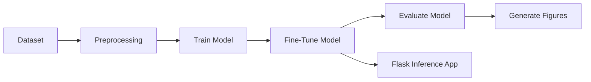
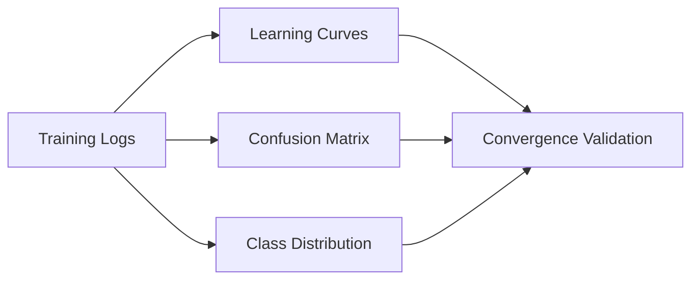

# EfficientNetV2-Based Plant Leaf Disease Detection for Multi-Crop Diagnosis

## IEEE-Style Technical Report

Authors: Swapnil  
Repository: [Leaf_Disease_Detection](https://github.com/ItzSwapnil/Leaf_Disease_Detection)  
Date: March 2026

## Abstract

Plant disease detection remains a major challenge in precision agriculture due to visual similarity among diseases, class imbalance, and deployment constraints in low-resource environments. This work presents a deep learning pipeline for leaf-level disease recognition across 46 classes and 14 crop groups using EfficientNetV2B0 transfer learning. The implementation combines staged training, schedule-based optimization, reproducible evaluation, and a Flask control panel for operational use. On the latest validation run, the system achieved 97.40% top-1 accuracy, 99.73% top-3 accuracy, and a macro F1-score of 0.9657. The deployed workflow supports robust model discovery through unified .keras artifact resolution and includes automated figure generation for post-training analysis.

Index Terms: plant disease detection, EfficientNetV2, transfer learning, computer vision, precision agriculture, deep learning deployment.

## 1. Introduction

Early and accurate disease identification is essential for reducing yield loss and improving treatment timing in agricultural systems. Manual diagnosis is labor-intensive and often unavailable in field settings. Deep convolutional networks provide a scalable alternative but must satisfy both accuracy and practical deployment constraints.

This project addresses those constraints through:

1. A compact transfer-learning architecture (EfficientNetV2B0).
2. Multi-stage optimization (head training plus fine-tuning).
3. Operational tooling for training, evaluation, prediction, and visualization.
4. Consistent model artifact handling across all entry points.

## 2. System Overview

The implementation consists of four layers:

1. Data layer: training, validation, and test directories with class-wise organization.
2. Model layer: EfficientNetV2B0 backbone and task-specific classification head.
3. Workflow layer: scripts for train, fine-tune, evaluate, predict, and plot generation.
4. Serving layer: Flask web application with graphical workflow control and image inference.

### 2.1 Pipeline

### 2.2 Model Artifact Resolution

A shared resolver is used across application and scripts to select the best available .keras model in deterministic order:

1. models/leaf_disease_classifier.keras
2. models/leaf_disease_checkpoint.keras
3. first discovered .keras file in models/

This behavior is implemented centrally in model_paths.py and consumed by app.py, predict.py, model_evaluation.py, and visualization_pipeline.py.

## 3. Methodology

### 3.1 Data Preparation

Images are loaded through Keras pipelines, resized to 224x224, and preprocessed with EfficientNetV2 normalization. Training batches use augmentation to improve generalization; validation and test sets use deterministic preprocessing.

### 3.2 Architecture

The classifier stack is:

1. EfficientNetV2B0 (pretrained backbone).
2. GlobalAveragePooling2D.
3. BatchNormalization.
4. Dense(1024, ReLU).
5. Dropout(0.4).
6. Dense(46, softmax, float32 output).

### 3.3 Optimization Strategy

Training uses schedule-based AdamW with cosine restarts and label smoothing. The workflow is:

1. Phase 1: train task head with frozen backbone.
2. Phase 2: unfreeze top layers and continue fine-tuning.
3. Optional extended fine-tuning script for additional convergence.

ReduceLROnPlateau is intentionally disabled where schedule-based learning rates are active, preventing optimizer mutation conflicts.

### 3.4 Loss and Metrics

Categorical cross-entropy with label smoothing is used:

$$
\mathcal{L} = -\sum_{i=1}^{C} y_i^{(smooth)} \log(\hat{y}_i)
$$

with

$$
y_i^{(smooth)} = (1-\alpha)y_i + \frac{\alpha}{C}
$$

where $C=46$ and $\alpha=0.1$.

Primary metrics include top-1 accuracy, top-3 accuracy, macro precision, macro recall, and macro F1-score.

## 4. Experimental Setup

### 4.1 Environment

1. Python 3.13 environment managed with uv.
2. TensorFlow/Keras stack with optional GPU acceleration.
3. Reproducibility controls through deterministic seeding and consistent preprocessing.

### 4.2 Dataset Scope

The dataset spans approximately 240k images across:

1. 46 disease/health classes.
2. 14 crop groups.
3. train/val/test directory partitions.

## 5. Results

### 5.1 Latest Validation Run

The latest successful evaluation reported:

1. Validation loss: 1.0340
2. Validation accuracy: 97.40%
3. Validation top-3 accuracy: 99.73%
4. Macro precision: 0.9686
5. Macro recall: 0.9668
6. Macro F1-score: 0.9657

### 5.2 Training Observations

1. Base training completed with best phase checkpoint at val_accuracy approximately 96.69%.
2. Extended fine-tuning employed early stopping and restored best epoch weights.
3. End-to-end workflow (train, fine-tune, evaluate, figures) completed successfully in the control panel.

### 5.3 Generated Artifacts

The visualization workflow generates:

1. class_distribution.png
2. learning_curves.png
3. model_architecture.png
4. confusion_matrix.png
5. sample_predictions.png

### 5.4 Visual Evidence

## 6. Deployment and Operational Notes

### 6.1 Web Inference

The Flask interface supports:

1. Image upload and prediction.
2. Control-panel execution for train, fine-tune, evaluate, and figure jobs.
3. Runtime status, progress telemetry, and log streaming.

### 6.2 Robustness Improvements

Recent engineering updates include:

1. Optional TensorBoard callback handling when package is unavailable.
2. Evaluation API fix for multi-metric outputs using return_dict.
3. Unified model-path fallback to avoid startup and inference failures.
4. Consistent .keras-only artifact policy.

## 7. Limitations and Future Work

Current limitations:

1. Domain shift from controlled datasets to field captures may reduce accuracy.
2. Some classes remain visually similar under low-quality acquisition.
3. Real-time edge deployment constraints are hardware-dependent.

Planned extensions:

1. Quantization-aware export for edge targets.
2. Calibration analysis and confidence-threshold studies.
3. Expanded cross-domain validation on external field datasets.
4. Structured ablation of augmentation and schedule parameters.

## 8. Conclusion

This project demonstrates a production-oriented plant disease recognition pipeline that couples strong classification performance with practical operational tooling. The latest validated metrics (97.40% top-1 and 99.73% top-3) indicate that EfficientNetV2B0 transfer learning, schedule-based optimization, and disciplined evaluation can deliver reliable multi-class diagnosis. Unified model artifact resolution and improved documentation strengthen maintainability and reproducibility for continued research and deployment.

## References

[1] S. P. Mohanty, D. P. Hughes, and M. Salathe, "Using deep learning for image-based plant disease detection," Frontiers in Plant Science, vol. 7, 2016.

[2] M. Tan and Q. Le, "EfficientNetV2: Smaller models and faster training," in Proc. ICML, 2021.

[3] K. P. Ferentinos, "Deep learning models for plant disease detection and diagnosis," Computers and Electronics in Agriculture, vol. 145, pp. 311-318, 2018.

[4] E. C. Too, L. Yujian, S. Njuki, and L. Yingchun, "A comparative study of fine-tuning deep learning models for plant disease identification," Computers and Electronics in Agriculture, vol. 161, pp. 272-279, 2019.
