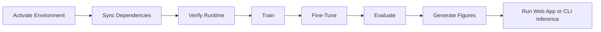

# Reproducible Execution Protocol (GPU-First)

This document defines the recommended execution sequence for reproducible training, evaluation, and inference on WSL (bash). For Windows IDE usage, configure the interpreter as `.venv\\Scripts\\python.exe`.

## Execution Flow



## 1. Environment Activation

```bash
cd /mnt/c/Users/Swapnil/Projects/Leaf_Disease_Detection
source .venv/bin/activate
```

## 2. Dependency Synchronization

```bash
uv lock --refresh
uv sync
```

## 3. Runtime Verification

```bash
uv run python - <<'PY'
import tensorflow as tf
print("TF version:", tf.__version__)
print("GPUs:", tf.config.list_physical_devices('GPU'))
PY
```

## 4. Optional One-Time GPU Warm-Up

```bash
uv run python - <<'PY'
import tensorflow as tf, numpy as np
x = tf.constant(np.random.rand(2,224,224,3), dtype=tf.float32)
m = tf.keras.applications.EfficientNetV2B0(include_top=False, weights=None)
_ = m(x)
print("Warm-up completed; GPUs:", tf.config.list_physical_devices('GPU'))
PY
```

## 5. Base Training

```bash
uv run python train_model.py
```

## 6. Extended Fine-Tuning

```bash
uv run python fine_tune_model.py
```

## 7. Evaluation

```bash
uv run python evaluate_model.py
```

Model artifact resolution order used by app and scripts:

1. `models/leaf_disease_classifier.keras`
2. `models/leaf_disease_checkpoint.keras`
3. First discovered `.keras` file in `models/`

## 8. Web Application

```bash
uv run python app.py
# Open http://127.0.0.1:5000
```

## 9. CLI Inference

```bash
uv run python predict_cli.py --image dataset/test/<Class>/<image>.jpg --top_k 3
```

## Execution Notes

1. Input resolution is 224x224 for training and inference.
2. Current training configuration uses batch size 16 for base training.
3. TensorFlow runtime is configured to prefer GPU when available.
4. PTX JIT warnings on first heavy run can be expected on newer GPU architectures.
5. If a final classifier artifact is absent, automatic fallback to available `.keras` artifacts is enabled.
