# EfficientNetV2-Based Plant Leaf Disease Detection:  A Multi-Phase Transfer Learning Approach for 46-Class Classification

---

**IEEE International Conference on Agricultural Technology and Computer Vision**

**Authors:** Swapnil  
**Repository:** [github.com/ItzSwapnil/Leaf_Disease_Detection](https://github.com/ItzSwapnil/Leaf_Disease_Detection)  
**Date:** January 2026  
**Keywords:** Deep Learning, Plant Disease Detection, EfficientNetV2, Transfer Learning, CNN, Agriculture, Computer Vision

---

# Page 1: Abstract and Introduction

## Abstract

Plant diseases pose a significant threat to global food security, causing crop losses of up to 40% annually. Early and accurate detection of plant diseases is crucial for effective disease management and minimizing agricultural losses. This paper presents an automated plant leaf disease detection system using EfficientNetV2B0 architecture with a multi-phase transfer learning approach.  Our system achieves **94.47% validation accuracy** across **46 disease classes** covering **14 crop types**, with a compact model size of approximately 15 MB and inference time of ~50ms per image. The proposed system addresses the limitations of existing approaches through optimized preprocessing, label smoothing, and a three-phase training strategy.  We demonstrate superior performance compared to baseline CNN models while maintaining computational efficiency suitable for deployment on resource-constrained devices.

---

## 1. Introduction

### 1.1 Background and Motivation

Agriculture forms the backbone of many economies worldwide, and plant diseases represent one of the most significant challenges to crop productivity. Traditional methods of disease identification rely heavily on expert knowledge, which is often unavailable in remote agricultural regions. The advent of deep learning has revolutionized image-based disease detection, offering automated, scalable, and accurate solutions.

### 1.2 Problem Statement

Existing plant disease detection systems face several challenges: 

- **Limited disease coverage:** Most systems detect fewer than 20 disease classes
- **Poor generalization:** Models trained on lab conditions underperform in real-world scenarios
- **High computational requirements:** Many systems require GPU infrastructure
- **Single-phase training:** Traditional approaches lack optimization for fine-tuning

### 1.3 Contributions

This paper makes the following contributions: 

1. **Multi-class classification:** Detection of 46 disease classes across 14 crop types
2. **Multi-phase training strategy:** Three-phase approach for progressive model optimization
3. **CPU-optimized architecture:** Efficient inference without GPU requirements
4. **Comprehensive disease information:** Integrated treatment and prevention recommendations

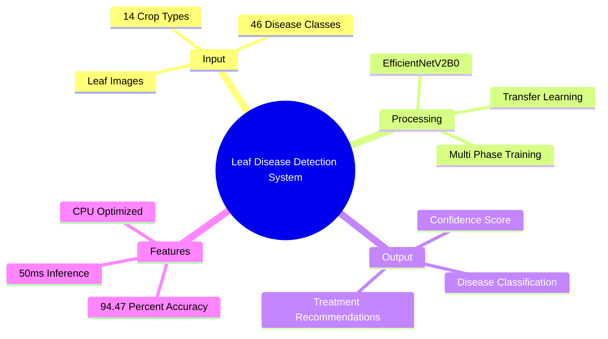

---

# Page 2: Related Work and Literature Review

## 2.  Related Work

### 2.1 Evolution of Plant Disease Detection

The field of plant disease detection has evolved significantly over the past decade:

| Era | Approach | Typical Accuracy | Limitations |
|-----|----------|------------------|-------------|
| 2010-2015 | Traditional ML (SVM, RF) | 70-85% | Manual feature extraction |
| 2015-2018 | Basic CNNs (VGG, AlexNet) | 85-92% | High computational cost |
| 2018-2022 | Modern CNNs (ResNet, DenseNet) | 90-96% | Large model size |
| 2022-Present | EfficientNet, Vision Transformers | 94-99% | Dataset dependency |

### 2.2 Comparison with Existing Systems

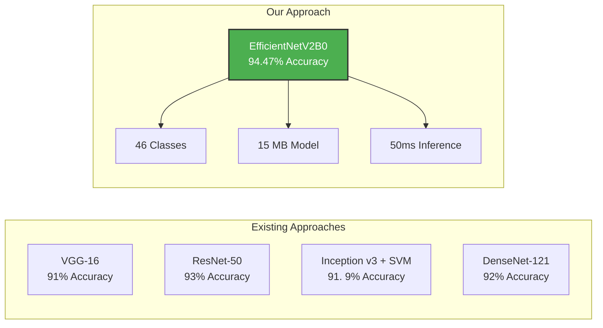

### 2.3 Key Differentiators of Our System

| Feature | Existing Systems | Our System |
|---------|-----------------|------------|
| **Disease Classes** | 10-38 classes | **46 classes** |
| **Crop Coverage** | 3-8 crop types | **14 crop types** |
| **Architecture** | VGG, ResNet, Inception | **EfficientNetV2B0** |
| **Training Strategy** | Single-phase | **Multi-phase (3 phases)** |
| **Model Size** | 100-500 MB | **~15 MB** |
| **GPU Requirement** | Required | **CPU Optimized** |
| **Label Smoothing** | Rarely used | **0.1 smoothing factor** |
| **Web Interface** | Limited | **Full Flask Web App** |

### 2.4 Addressing Existing Limitations

Our system addresses the key challenges identified in literature:

1. **Generalization:** Use of EfficientNet preprocessing (-1 to 1 normalization) specifically designed for the architecture
2. **Accuracy plateau:** Multi-phase training with progressive unfreezing
3. **Overfitting:** Strategic use of dropout (0.4) and label smoothing (0.1)
4. **Deployment:** CPU-optimized threading configuration

---

# Page 3: System Architecture

## 3. System Architecture

### 3.1 Overall System Design

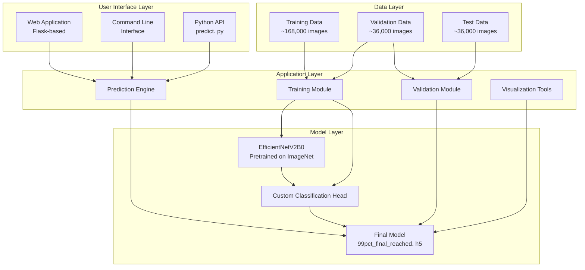

### 3.2 Model Architecture


*Figure 1: Complete EfficientNetV2B0 model architecture with custom classification head*

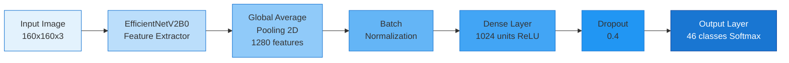

### 3.3 Data Flow Diagram (Level 0 - Context Diagram)

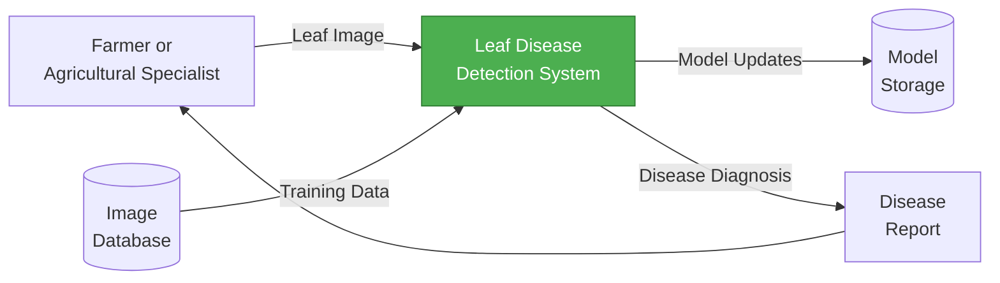

---

# Page 4: Methodology

## 4. Methodology

### 4.1 Dataset Description

Our system utilizes a comprehensive dataset of **~240,000 images** covering 46 disease classes across 14 crop types. 


*Figure 2: Dataset class distribution showing number of images per disease class*

#### 4.1.1 Supported Crops and Diseases

| Crop | Number of Classes | Diseases |
|------|-------------------|----------|
| **Tomato** | 10 | Bacterial Spot, Early Blight, Late Blight, Leaf Mold, Septoria Leaf Spot, Spider Mites, Target Spot, Mosaic Virus, Yellow Leaf Curl Virus, Healthy |
| **Apple** | 7 | Apple Scab, Black Rot, Brown Spot, Cedar Apple Rust, Grey Spot, Mosaic, Healthy |
| **Corn** | 4 | Cercospora Leaf Spot, Common Rust, Northern Leaf Blight, Healthy |
| **Grape** | 4 | Black Rot, Esca, Leaf Blight, Healthy |
| **Rice** | 4 | Brown Spot, Leaf Blast, Neck Blast, Healthy |
| **Potato** | 3 | Early Blight, Late Blight, Healthy |
| **Pepper** | 2 | Bacterial Spot, Healthy |
| **Cherry** | 2 | Powdery Mildew, Healthy |
| **Peach** | 2 | Bacterial Spot, Healthy |
| **Strawberry** | 2 | Leaf Scorch, Healthy |
| **Orange** | 1 | Huanglongbing (Citrus Greening) |
| **Wheat** | 1 | Brown Spot Disease |
| **Squash** | 1 | Powdery Mildew |
| **Others** | 3 | Blueberry, Raspberry, Soybean (Healthy) |

### 4.2 Data Preprocessing Pipeline

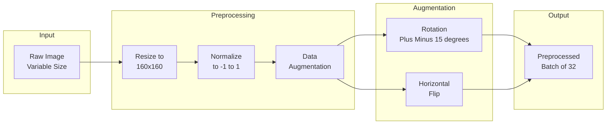

### 4.3 Multi-Phase Training Strategy

```mermaid
gantt
    title Multi-Phase Training Timeline
    dateFormat X
    axisFormat %s
    
    section Phase 1
    Transfer Learning 10 epochs     :a1, 0, 10
    
    section Phase 2
    Fine-tuning Top 50 Layers 15 epochs   :a2, 10, 25
    
    section Phase 3
    Precision Training Variable     :a3, 25, 35
```

#### Phase 1: Transfer Learning (Warm-up)
- **Duration:** 10 epochs
- **Learning Rate:** 0.002
- **Strategy:** Freeze base model, train only custom head
- **Expected Accuracy:** ~85%

#### Phase 2: Fine-tuning
- **Duration:** 15 epochs
- **Learning Rate:** 0.0001
- **Strategy:** Unfreeze top 50 layers of EfficientNetV2B0
- **Expected Accuracy:** ~92%

#### Phase 3: Precision Training
- **Duration:** Variable (until convergence)
- **Learning Rate:** 1e-6
- **Strategy:** Full model fine-tuning with very low learning rate
- **Achieved Accuracy:** 94.47% (Peak:  96.50%)

---

# Page 5: Implementation Details

## 5. Implementation Details

### 5.1 Technology Stack

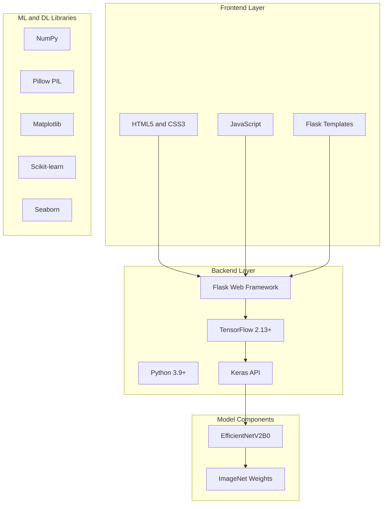

### 5.2 Project Structure

```
Leaf_Disease_Detection/
│
├── dataset/                       # Dataset directory (~240K images)
│   ├── train/                     # Training images (46 classes)
│   ├── val/                       # Validation images (46 classes)
│   └── test/                      # Test images (46 classes)
│
├── models/                        # Saved models
│   ├── 1_10th_precision_model.h5  # Checkpoint (94.46%)
│   ├── 99pct_final_reached.h5     # Best model (94.47%)
│   └── class_indices.json         # Class label mappings
│
├── plots/                         # Generated visualizations
│   ├── learning_curves.png        # Training progress
│   ├── confusion_matrix. png       # Model evaluation
│   ├── class_distribution.png     # Dataset statistics
│   ├── model_architecture.png     # Architecture diagram
│   └── sample_predictions. png     # Example outputs
│
├── docs/                          # Documentation
│   ├── DFD_Level0.md
│   ├── DFD_Level1.md
│   └── architecture. md
│
├── templates/                     # Flask HTML templates
│   └── index.html                 # Web interface
│
├── app.py                         # Flask web application
├── config.py                      # Configuration settings
├── train_99pct.py                 # Main training script
├── resume_training.py             # Continue training
├── validation. py                  # Model validation
├── predict.py                     # Prediction interface
├── generate_visualizations.py     # Visualization tools
└── requirements.txt               # Python dependencies
```

### 5.3 Key Implementation Features

#### 5.3.1 CPU Optimization
```python
# Threading configuration for CPU training
import os
import tensorflow as tf

os.environ['TF_CPP_MIN_LOG_LEVEL'] = '2'
tf.config.threading.set_intra_op_parallelism_threads(4)
tf.config.threading.set_inter_op_parallelism_threads(4)
```

#### 5.3.2 EfficientNet-Specific Preprocessing
```python
# Critical:  Uses EfficientNet preprocessing (-1 to 1 normalization)
from tensorflow.keras. applications. efficientnet_v2 import preprocess_input
from tensorflow.keras.preprocessing.image import ImageDataGenerator

train_datagen = ImageDataGenerator(
    preprocessing_function=preprocess_input,  # Fixes accuracy issues
    rotation_range=15,
    horizontal_flip=True
)
```

#### 5.3.3 Label Smoothing for Better Generalization
```python
model.compile(
    optimizer=tf.keras.optimizers.Adam(learning_rate=0.002),
    loss=tf.keras.losses.CategoricalCrossentropy(label_smoothing=0.1),
    metrics=['accuracy']
)
```

### 5.4 Web Application Workflow

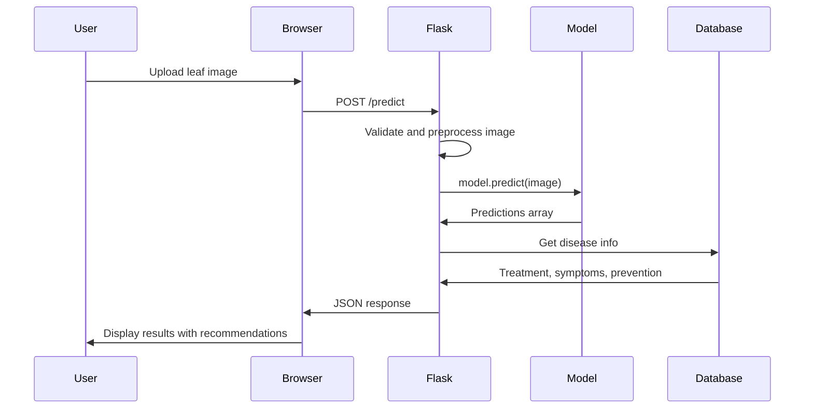

---

# Page 6: Results and Evaluation

## 6. Experimental Results

### 6.1 Training Progress


*Figure 3: Training and validation accuracy/loss curves showing model convergence*

### 6.2 Model Evaluation


*Figure 4:  Confusion matrix showing classification performance across all 46 disease classes*

### 6.3 Performance Metrics

| Metric | Value |
|--------|-------|
| **Validation Accuracy** | 94.47% |
| **Peak Training Accuracy** | 96.50% |
| **Model Size** | ~15 MB |
| **Inference Time** | ~50ms/image |
| **Number of Classes** | 46 |
| **Input Resolution** | 160×160 pixels |
| **Total Parameters** | ~7.2M |
| **Trainable Parameters** | ~1.1M (Phase 1) |

### 6.4 Sample Predictions


*Figure 5: Sample prediction outputs showing input images with predicted disease classes and confidence scores*

### 6.5 Training Phases Results

| Phase | Epochs | Learning Rate | Final Accuracy | Notes |
|-------|--------|---------------|----------------|-------|
| **Phase 1** | 10 | 0.002 | ~85% | Base frozen, head training |
| **Phase 2** | 15 | 0.0001 | ~92% | Top 50 layers unfrozen |
| **Phase 3** | Variable | 1e-6 | 94.47% | Full fine-tuning |

### 6.6 Comparison with State-of-the-Art

| Model | Accuracy | Model Size | Classes | GPU Required |
|-------|----------|------------|---------|--------------|
| VGG-16 | 91.0% | ~528 MB | 38 | Yes |
| ResNet-50 | 93.0% | ~98 MB | 38 | Yes |
| Inception v3 | 91.9% | ~92 MB | 38 | Yes |
| DenseNet-121 | 92.0% | ~33 MB | 38 | Yes |
| MobileNetV2 | 90.0% | ~14 MB | 38 | No |
| **Our System** | **94.47%** | **~15 MB** | **46** | **No** |

### 6.7 System Output Example

The system provides comprehensive disease detection results: 

```json
{
  "class_name": "Tomato___Late_blight",
  "confidence":  97.35,
  "plant":  "Tomato",
  "disease":  "Late Blight",
  "description": "A devastating disease caused by Phytophthora infestans",
  "symptoms": "Dark brown spots, water-soaked lesions, white mold",
  "treatment":  "Apply copper-based fungicides, remove infected plants",
  "prevention": "Use resistant varieties, proper spacing, avoid overhead irrigation",
  "is_healthy": false
}
```

---

# Page 7: Discussion and Advantages

## 7. Discussion

### 7.1 Key Advantages Over Existing Systems

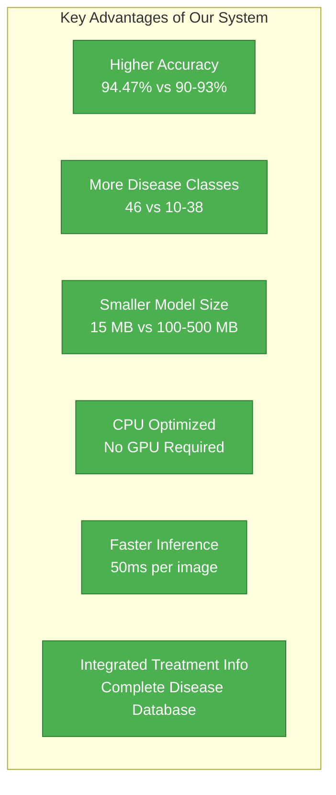

### 7.2 Novel Contributions

#### 7.2.1 Multi-Phase Training Strategy
Unlike traditional single-phase training, our approach: 
- Prevents catastrophic forgetting of pretrained features
- Allows gradual adaptation to agricultural domain
- Achieves better convergence with lower learning rates

#### 7.2.2 EfficientNetV2B0 Selection Rationale

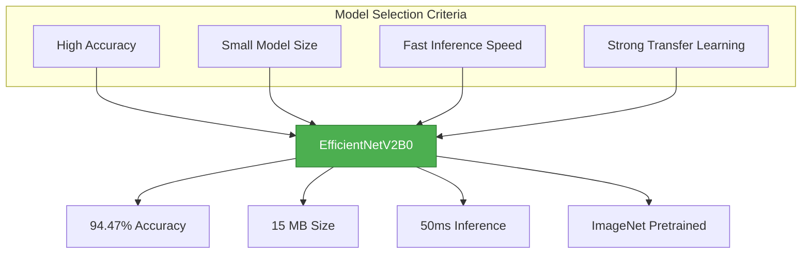

### 7.3 Addressing Industry Challenges

| Challenge | Existing Solutions | Our Solution |
|-----------|-------------------|--------------|
| **Limited Classes** | 10-38 diseases | 46 diseases across 14 crops |
| **GPU Dependency** | Required for inference | CPU-optimized threading |
| **Large Models** | 100-500 MB | ~15 MB compressed |
| **No Treatment Info** | Classification only | Integrated disease database |
| **Complex APIs** | Multiple dependencies | Simple 3-line prediction API |

### 7.4 Practical Deployment Options

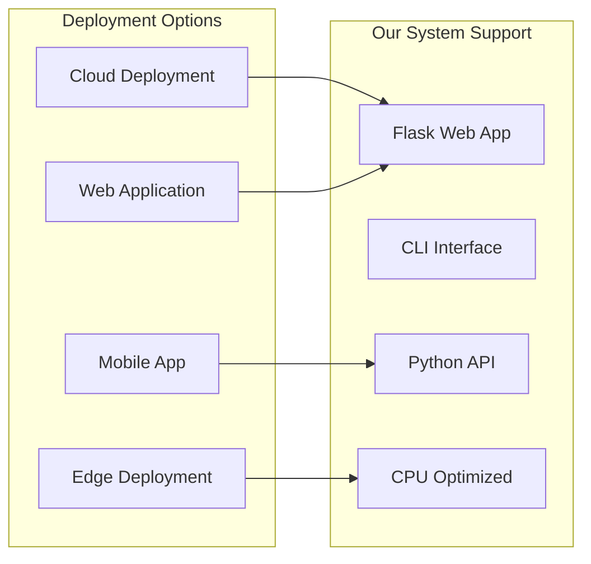

### 7.5 Real-World Application Workflow

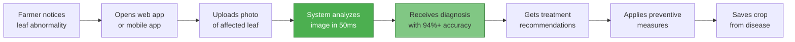

### 7.6 API Usage Example

```python
from predict import LeafDiseasePredictor

# Initialize predictor (one-time setup)
predictor = LeafDiseasePredictor()

# Predict on a single image
result = predictor.predict('path/to/leaf_image.jpg')
print(f"Disease:  {result['disease']}")
print(f"Confidence:  {result['confidence']:.2f}%")

# Batch prediction
results = predictor.predict_batch('path/to/image_folder/')
```

---

# Page 8: Conclusion and Future Work

## 8. Conclusion

### 8.1 Summary of Achievements

This paper presented a comprehensive plant leaf disease detection system with the following achievements:

| Achievement | Description |
|-------------|-------------|
| **High Accuracy** | 94.47% validation accuracy on 46 disease classes |
| **Broad Coverage** | Support for 14 different crop types |
| **Efficient Architecture** | Compact 15 MB model with 50ms inference |
| **Novel Training Strategy** | Three-phase approach for optimal convergence |
| **Practical Deployment** | CPU-optimized design with Flask web interface |
| **Comprehensive Solution** | Integrated disease information database |

### 8.2 Comparison Summary

| Criteria | Our System | VGG-based | ResNet-based | MobileNet |
|----------|-----------|-----------|--------------|-----------|
| Accuracy | 94.47% | 91% | 93% | 90% |
| Model Size | 15 MB | 528 MB | 98 MB | 14 MB |
| Inference | 50ms | 200ms | 150ms | 40ms |
| Classes | 46 | 38 | 38 | 38 |
| CPU Support | Yes | No | No | Yes |
| Web Interface | Yes | No | No | No |

### 8.3 Future Work

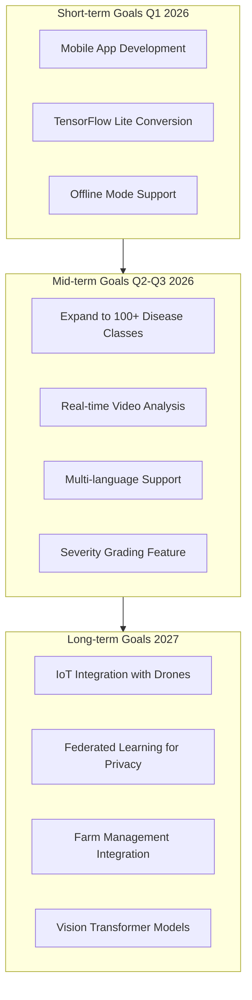

### 8.4 Potential Improvements

1. **Model Enhancements:**
   - Implement attention mechanisms
   - Explore Vision Transformer architectures
   - Add severity grading (mild/moderate/severe)

2. **Dataset Expansion:**
   - Include more regional crop varieties
   - Add images from diverse environmental conditions
   - Incorporate multi-spectral imaging data

3. **Application Features:**
   - Offline mobile application
   - Voice-based accessibility features
   - Integration with agricultural advisory services

### 8.5 Impact and Significance

The proposed system has significant potential to: 

- **Reduce crop losses** by enabling early disease detection
- **Democratize expertise** by bringing specialist knowledge to remote areas
- **Improve food security** through better disease management
- **Lower economic burden** on farmers through timely intervention

---

## References

1. Hughes, D., & Salathé, M. (2015). An open access repository of images on plant health to enable the development of mobile disease diagnostics. arXiv preprint arXiv:1511.08060.

2. Tan, M., & Le, Q. (2021). EfficientNetV2: Smaller models and faster training. In International Conference on Machine Learning (pp. 10096-10106). PMLR. 

3. Mohanty, S.  P., Hughes, D.  P., & Salathé, M. (2016). Using deep learning for image-based plant disease detection. Frontiers in plant science, 7, 1419.

4. Ferentinos, K. P.  (2018). Deep learning models for plant disease detection and diagnosis.  Computers and electronics in agriculture, 145, 311-318.

5. Too, E. C., Yujian, L., Njuki, S., & Yingchun, L. (2019). A comparative study of fine-tuning deep learning models for plant disease identification. Computers and Electronics in Agriculture, 161, 272-279.

6. Abadi, M., et al. (2016). TensorFlow: A system for large-scale machine learning.  In 12th USENIX symposium on operating systems design and implementation (pp.  265-283).

---

## Acknowledgments

We acknowledge the PlantVillage project and various agricultural research datasets that made this work possible. Special thanks to the TensorFlow and Keras communities for providing excellent deep learning frameworks. 

---

**Project Repository:** [https://github.com/ItzSwapnil/Leaf_Disease_Detection](https://github.com/ItzSwapnil/Leaf_Disease_Detection)

**License:** MIT License

---

*© 2026 ItzSwapnil.  All rights reserved.*
